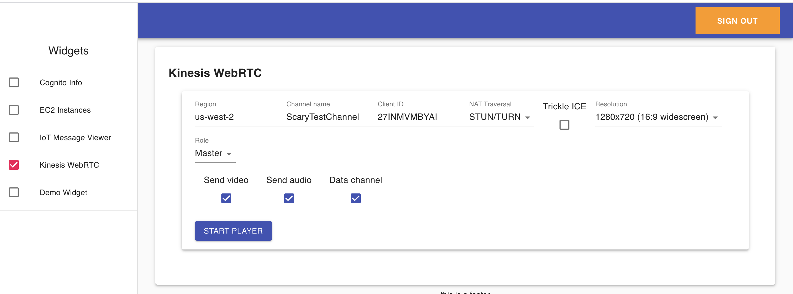

# AWS Amplify Toolkit

This is an AWS Amplify project that provides a web interface for demoing/testing aspects of AWS with a simple browser app.

This is really meant as a learning tool, not anything for production. 

## Security

This is a demo tool I use in my test account, so it creates Cognito users that have a federated identity with administrative `*:*` permissions. 

Because of that, you don't want just anybody to be able to sign up via your Cognito user pool. Therefore, I've disabled user signup and enforced "Admin-only user creation", meaning that an IAM user or role must use the Cognito administrative APIs (or the Cognito web console) to create users. This change is done by modifying the default CloudFormation created by the `amplify add auth` command, [as shown here](https://github.com/matwerber1/aws-amplify-react-toolkit/blob/e5bdb5d67343f736ea2a110e1f7a9a9bd6bcf81c/amplify/backend/auth/awstoolkitd5af8046d5af8046/awstoolkitd5af8046d5af8046-cloudformation-template.yml#L165).

## Deployment

1. Install the AWS Amplify CLI: 
  
    `npm install -g @aws-amplify/cli`

1. Clone this repository:

    `git clone https://github.com/matwerber1/aws-amplify-react-toolkit`

1. Configure amplify:

    `amplify configure`

    In order for Amplify to create resources in your AWS account, you need to provide Amplify with AWS credentials, aka an IAM user or role's access key, secret key, and - if you're assuming a temporary role, a session token).
    
    If you have previously installed and configured [the AWS CLI](https://docs.aws.amazon.com/cli/latest/userguide/install-cliv2.html), this will save your access credentials as a "profile" in `~/.aws/credentials`. When prompted by `amplify configure` whether you want to use an existing profile, you can say "yes" and choose one of your previously created profiles.

    If you answer "no", Amplify will open prompt you to create a new IAM user and save the credentials locally so that the Amplify has CLI permission to create resources on your behalf.

1. From the repository root, run:
  
    `amplify init`
    
    This will create the "barebones" resources for your Amplify project.

1.  Create additional resources defined in the project, such as a Cognito user pool, by running:

    `amplify push`

1. Run the web app locally via `npm run start`

1. Go to the Cognito User Pool web console in your AWS account and create a user, then add them to the `admin` user group

1. Log in locally and enjoy! (?)

## Adding Widgets

This project breaks functionality into "widgets". These are self-contained React components to test/demo different aspects of AWS in the browser. 

To create a widget:

1. Add your React component to `./src/components/widgets`. 
2. To make your widget appear in the left navigation menu, do the following:
  
  1. In `./src/components/body.js`, import your new component:

      ```js
      import MyNewWidget from './widgets/my-new-widgets';
      ```

  2. Within `./src/components/body.js`, modify the `const widgets = [{...}]` array:

      The array looks like this:

      ```js
      const widgets = [
      {
        component: UserInfo,
        displayName: 'Cognito Info',
        id: 'cognito-info',
        displayOnFirstLoad: true
      },
      ```

      For your new widget, add a new object to the array above. The `component` property should match the name of the component you imported, the `displayName` is whatever value you want shown to the user in the navigation menu, the `id` is an arbitrary, unique ID for the rendered component, and `displayOnFirstLoad` determines whether the widget is shown/activated when a user first logs in. 

## Current Widgets

**Cognito Info**

Displays the JWT of your user after signing in to Cognito. Useful for visualizing how Cognito works:


**EC2 Instance Viewer**

From the browser, uses the AWS SDK to call the `ec2.describeInstances()` API for a given region and display results:


**IoT Message Viewer**

Allows you to subscribe and/or publish to IoT topics via MQTT with AWS IoT Core's pubsub message broker.


**Kinesis Video WebRTC Viewer/Player**

Connect to a [Kinesis Video WebRTC signaling channel](https://docs.aws.amazon.com/kinesisvideostreams-webrtc-dg/latest/devguide/what-is-kvswebrtc.html) to send/receive live video. 

