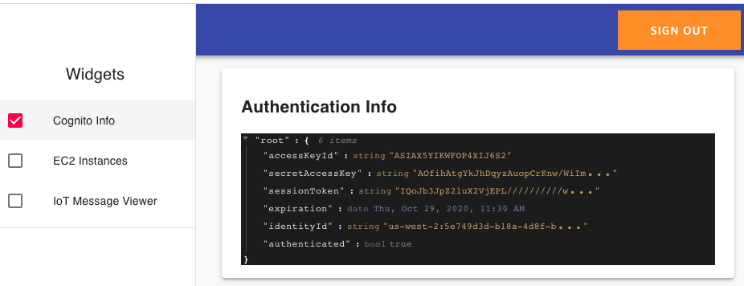
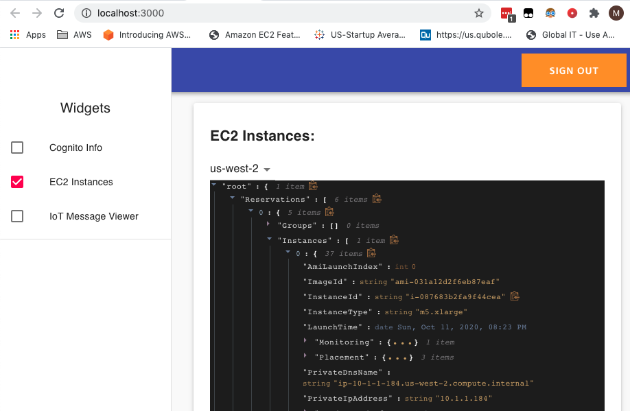
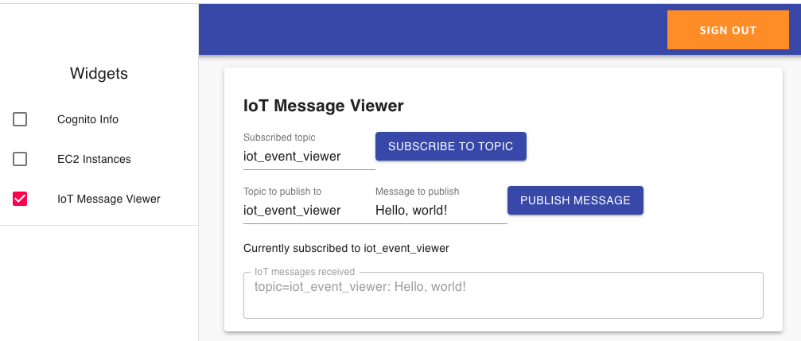

# AWS Amplify Toolkit

This is an AWS Amplify project that provides a web interface for demoing/testing aspects of AWS with a simple browser app.

This is really meant as a learning tool, not anything for production. 

## Security

This is a demo tool I use in my test account, so it creates Cognito users that have a federated identity with administrative `*:*` permissions. 

Because of that, you don't want just anybody to be able to sign up via your Cognito user pool. Therefore, I've disabled user signup and enforced "Admin-only user creation", meaning that an IAM user or role must use the Cognito administrative APIs (or the Cognito web console) to create users. This change is done by modifying the default CloudFormation created by the `amplify add auth` command, [as shown here](https://github.com/matwerber1/aws-amplify-react-toolkit/blob/e5bdb5d67343f736ea2a110e1f7a9a9bd6bcf81c/amplify/backend/auth/awstoolkitd5af8046d5af8046/awstoolkitd5af8046d5af8046-cloudformation-template.yml#L165).

## Deployment

1. Install the AWS Amplify CLI
2. Clone this repository
3. From the repository root, run `amplify init`, followed by `amplify push`
4. Run the web app locally via `npm run start`
5. Go to the Cognito User Pool web console in your AWS account and create a user, then add them to the `admin` user group
6. Log in locally and enjoy! (?)

## Current Widgets

**Cognito Info**

Displays the JWT of your user after signing in to Cognito. Useful for visualizing how Cognito works:

**EC2 Instance Viewer**

From the browser, uses the AWS SDK to call the `ec2.describeInstances()` API for a given region and display results:

**IoT Message Viewer** - publish and/or subscribe to an AWS IoT topic.

Allows you to subscribe and/or publish to IoT topics via MQTT with AWS IoT Core's pubsub message broker.

To use this widget, you need to create an AWS IoT policy per [these Amplify PubSub instructions](https://docs.amplify.aws/lib/pubsub/getting-started/q/platform/js#step-1-create-iam-policies-for-aws-iot). You also need to add your policy name, IoT endpoint, and region into the `./src/pubsub-config.js` document. Once you do that, the React app has code that will automatically attach the IoT policy to your Cognito user. 

